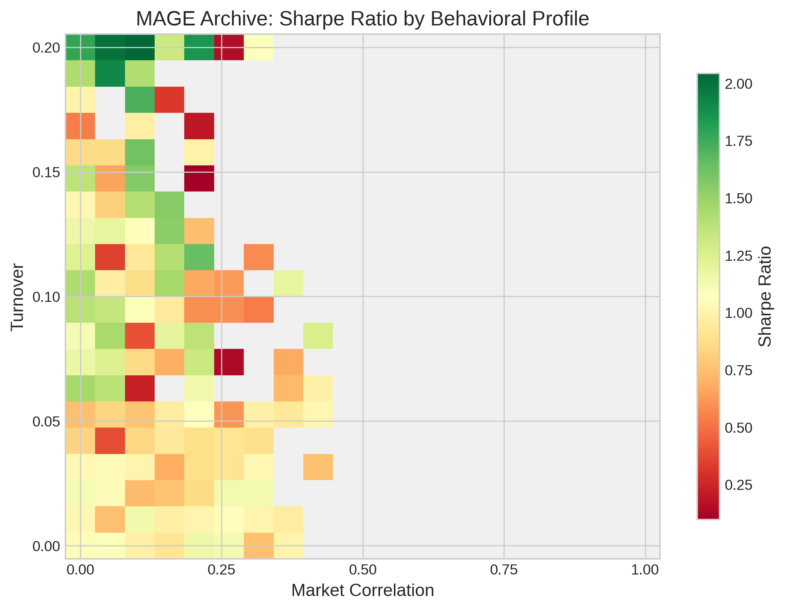
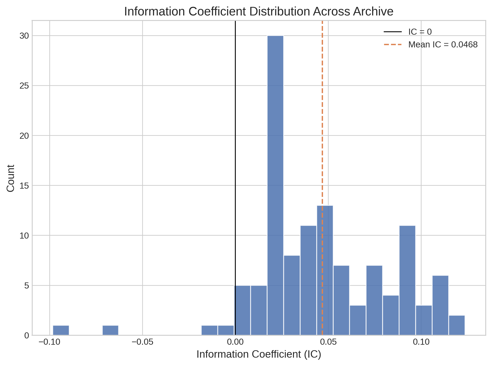
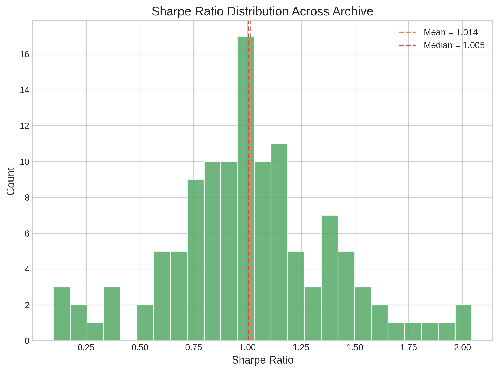

# MAGE: MAP-Elites for Alpha GEneration

MAGE uses MAP-Elites, a quality-diversity evolutionary algorithm, to discover diverse alpha factors for quantitative trading. In finance, relying on a single trading strategy is dangerous. Markets shift, correlations break, and the best-performing factor today may fail tomorrow. A portfolio manager needs a collection of strategies that behave differently from each other, so that when one stops working, the others keep generating returns. MAGE addresses this by evolving alpha factors on a two-dimensional behavioral grid defined by **turnover** (how frequently the strategy rebalances) and **market correlation** (how much the strategy's returns track the overall market). Each cell in the grid keeps only the best alpha for that particular behavioral profile. The result is a structured archive of high-quality, behaviorally distinct alpha factors ready for portfolio construction.

---

## What Are Alpha Factors?

An **alpha factor** is a formula that predicts which stocks will go up and which will go down. You feed it raw market data for each stock (prices and trading volume over time) and it produces a score. Stocks with high scores are expected to outperform; stocks with low scores are expected to underperform. A portfolio manager ranks all stocks by their alpha score, buys the top-ranked ones ("long"), and sells the bottom-ranked ones ("short"). If the alpha is any good, the long stocks rise more than the short stocks fall, and the portfolio makes money regardless of whether the overall market goes up or down.

The raw inputs are **OHLCV data**: Open, High, Low, Close, and Volume. These are recorded for every stock on every trading day. Open is the price at market open. High and Low are the maximum and minimum prices during the day. Close is the price at market close. Volume is how many shares were traded. A derived feature called **VWAP** (volume-weighted average price) is computed from these: roughly `(high + low + close) / 3`. An alpha formula like `sub(ts_ema(low, 60), close)` says "compute the 60-day exponential moving average of each stock's daily low price, then subtract today's closing price." Stocks where the smoothed low is far above the current close might be mean-reverting, so the alpha buys them.

To measure whether an alpha works, we use several metrics. **IC** (Information Coefficient) is the daily cross-sectional correlation between the alpha's scores and the stocks' actual returns over the next 20 trading days. An IC of 0.05 means weak but meaningful predictive power; 0.10 is strong. **Sharpe ratio** measures the risk-adjusted return of a long-short portfolio: annualized mean return divided by annualized volatility. A Sharpe above 1.0 is considered good. **Turnover** measures how much the portfolio's holdings change each day; high turnover means more trading and more transaction costs. **Market correlation** measures how much the alpha's returns move with the broad market; low market correlation means the alpha captures something beyond just "stocks go up when the market goes up." In the backtest, we go long the top 20% of stocks by alpha score and short the bottom 20%, rebalancing daily based on new scores.

---

## What Is MAP-Elites?

MAP-Elites (Mouret and Clune, 2015) is a quality-diversity algorithm. Standard genetic programming (GP) maintains a single population and selects parents by fitness. Over many generations, the population converges to a narrow region of the search space: the single best solution it can find. This is fine if you only need one answer. It is not fine if you need many different answers.

MAP-Elites replaces the population with a grid-structured archive. Each cell in the grid corresponds to a specific combination of behavioral descriptors. When a new solution is evaluated, the algorithm computes both its fitness and its behavioral coordinates, then places it in the appropriate cell. If the cell was empty, the solution fills it. If the cell already had a solution, the new one replaces it only if its fitness is higher. This way, each cell always holds the best solution discovered so far for that particular behavior.

In MAGE, the grid has two axes:

- **Market correlation** (x-axis): ranges from 0 to 1, discretized into 20 bins. Low-correlation alphas are market-neutral; high-correlation alphas track the market.
- **Turnover** (y-axis): ranges from 0 to 0.2, discretized into 20 bins. Low-turnover alphas rebalance slowly; high-turnover alphas trade frequently.

This creates a 20x20 grid with 400 possible cells. The search fills as many cells as it can, and within each cell it pushes the Sharpe ratio as high as possible.

```
Market Correlation (y)
1.0 |  .  .  .  .  .  .  .  .  .  .  .  .  .  .  .  .  .  .  .  .
    |  .  .  .  .  .  .  .  .  .  .  .  .  .  .  .  .  .  .  .  .
    |  .  .  #  .  #  #  #  .  .  .  .  .  .  .  .  .  .  .  .  .
    |  .  #  #  #  #  #  #  #  .  #  .  .  .  .  .  .  .  .  .  .
    |  #  #  #  #  #  #  .  .  #  #  .  .  .  .  #  .  .  .  .  .
    |  #  #  #  #  #  #  #  .  #  .  .  .  .  .  .  .  .  .  .  .
    |  #  #  #  #  #  .  .  .  .  .  .  .  .  .  .  .  .  .  .  .
    |  #  #  #  #  #  #  #  #  #  #  .  #  .  #  .  .  .  .  .  .
    |  #  #  #  #  #  #  #  #  #  #  #  .  #  #  .  .  #  .  .  #
    |  #  #  #  #  #  #  #  #  #  #  #  #  #  #  #  .  #  #  #  #
0.0 |____________________________________________________________
    0.0                    Turnover (x)                       0.2

    .  = empty cell       #  = cell occupied by an elite alpha
```

Why does this matter for finance? Standard GP run 10 times will converge to the same factor family 8 out of 10 times (our experiments confirm this with a mean pairwise correlation of 0.494 across runs). Those 10 "different" alphas are really minor variants of the same signal. Combining them in a portfolio gives almost no diversification benefit. MAP-Elites forces diversity by construction. Alphas in different grid cells have different turnover and market correlation profiles. When you combine uncorrelated alphas, the portfolio's Sharpe ratio improves because the errors of one alpha are not correlated with the errors of another. This is a basic result in portfolio theory: diversification works.

---

## The Operator Set (28 Operators)

Alpha expressions are trees built from 28 operators operating on 6 input features (`open`, `high`, `low`, `close`, `volume`, `vwap`). The operators fall into four groups based on two distinctions:

**Cross-sectional vs. time-series.** A cross-sectional operator works across all stocks at a single point in time. For example, `cs_rank(close)` ranks all 50 stocks by their closing price on day _t_, giving each stock a percentile from 0 to 1. Stock with the highest close gets rank 1.0; the lowest gets rank ~0.02. A time-series operator works across time for a single stock. For example, `ts_rank(close, 20)` looks at one stock's closing prices over the past 20 days and reports where today's close falls as a percentile within that window. These are fundamentally different computations even though both are called "rank."

**Unary vs. binary.** Unary operators take one input series (plus an optional window parameter). Binary operators take two input series (plus an optional window parameter).

### Cross-Sectional Unary (4 operators)

| Operator | Description | Example |
|----------|-------------|---------|
| `cs_abs(x)` | Absolute value | `cs_abs(returns)` = magnitude of daily returns |
| `cs_log(x)` | Natural log (0 for non-positive inputs) | `cs_log(volume)` = log trading volume |
| `cs_sign(x)` | Sign: -1, 0, or +1 | `cs_sign(returns)` = direction of daily move |
| `cs_rank(x)` | Cross-sectional percentile rank (0 to 1) | `cs_rank(close)` = relative price rank among all stocks today |

### Cross-Sectional Binary (7 operators)

| Operator | Description | Example |
|----------|-------------|---------|
| `add(x, y)` | Elementwise addition | `add(close, volume)` |
| `sub(x, y)` | Elementwise subtraction | `sub(high, low)` = daily price range |
| `mul(x, y)` | Elementwise multiplication | `mul(close, volume)` = dollar volume proxy |
| `div(x, y)` | Safe division (returns 0 when denominator < 1e-10) | `div(close, open)` = intraday return ratio |
| `pow(x, y)` | Signed power: `sign(x) * |x|^clip(y, -3, 3)` | `pow(volume, returns)` |
| `greater(x, y)` | Elementwise maximum | `greater(open, close)` = max of open and close |
| `less(x, y)` | Elementwise minimum | `less(high, low)` = always equals low |

### Time-Series Unary (15 operators)

All take a window parameter `d` specifying the lookback period in trading days.

| Operator | Window Range | Description | Example |
|----------|-------------|-------------|---------|
| `ts_ref(x, d)` | 1-20 | Value `d` days ago | `ts_ref(close, 5)` = closing price 5 days ago |
| `ts_delta(x, d)` | 1-20 | Change from `d` days ago: `x - ts_ref(x, d)` | `ts_delta(volume, 10)` = 10-day volume change |
| `ts_mean(x, d)` | 3-60 | Rolling mean over `d` days | `ts_mean(close, 20)` = 20-day simple moving average |
| `ts_med(x, d)` | 3-60 | Rolling median over `d` days | `ts_med(volume, 10)` = 10-day median volume |
| `ts_sum(x, d)` | 3-60 | Rolling sum over `d` days | `ts_sum(volume, 5)` = 5-day cumulative volume |
| `ts_std(x, d)` | 3-60 | Rolling standard deviation | `ts_std(close, 20)` = 20-day price volatility |
| `ts_var(x, d)` | 3-60 | Rolling variance | `ts_var(returns, 10)` = 10-day return variance |
| `ts_skew(x, d)` | 5-60 | Rolling skewness | `ts_skew(returns, 20)` = return distribution asymmetry |
| `ts_kurt(x, d)` | 5-60 | Rolling kurtosis (excess) | `ts_kurt(returns, 20)` = return distribution tail weight |
| `ts_max(x, d)` | 3-60 | Rolling maximum | `ts_max(high, 20)` = 20-day high |
| `ts_min(x, d)` | 3-60 | Rolling minimum | `ts_min(low, 20)` = 20-day low |
| `ts_mad(x, d)` | 3-60 | Rolling mean absolute deviation | `ts_mad(returns, 10)` |
| `ts_rank(x, d)` | 3-60 | Percentile rank within rolling window | `ts_rank(close, 20)` = where today's close falls in 20-day history |
| `ts_wma(x, d)` | 3-60 | Weighted moving average (linear decay) | `ts_wma(close, 10)` = recent days weighted more |
| `ts_ema(x, d)` | 3-60 | Exponential moving average | `ts_ema(close, 20)` = EMA with span 20 |

### Time-Series Binary (2 operators)

| Operator | Window Range | Description | Example |
|----------|-------------|-------------|---------|
| `ts_corr(x, y, d)` | 5-60 | Rolling Pearson correlation | `ts_corr(close, volume, 20)` = 20-day price-volume correlation |
| `ts_cov(x, y, d)` | 5-60 | Rolling covariance | `ts_cov(open, close, 10)` = 10-day open-close covariance |

This operator set matches AlphaGen (Yu et al., KDD 2023) and draws from Alpha101 (Kakushadze, 2016).

---

## Results

These results are from a full cluster run: population 200, 100 generations, 20x20 grid, 50 stocks (S&P 100 subset), training period 2010-2019. Run on 236 CPUs across 18 nodes (~4 minutes wall clock).

### Convergence

| Generation | Coverage | Best Sharpe | Mean Sharpe |
|------------|----------|-------------|-------------|
| 1 | 16 / 400 | 1.01 | 0.36 |
| 10 | 40 / 400 | 1.13 | 0.56 |
| 20 | 77 / 400 | 1.78 | 0.78 |
| 35 | 93 / 400 | 2.04 | 0.93 |
| 50 | 95 / 400 | 2.04 | 0.94 |
| 75 | 107 / 400 | 2.04 | 0.97 |
| 100 | 119 / 400 | 2.04 | 1.01 |

Coverage grows rapidly in early generations (77 cells by generation 20) and continues filling through generation 100. Best Sharpe reaches 2.04 at generation 35 and stabilizes. Mean Sharpe of archive elites improves steadily throughout the run.

### Top 10 Alphas (by training Sharpe)

| Train Sharpe | Val Sharpe | IC | Turnover | Mkt Corr | Expression |
|--------|------|------|----------|----------|------------|
| 2.04 | 3.37 | 0.015 | - | - | `div(add(vwap, high), close)` |
| 2.00 | 3.06 | 0.008 | - | - | `ts_ema(div(vwap, close), 3)` |
| 1.91 | 2.72 | 0.004 | - | - | `ts_ema(div(vwap, close), 5)` |
| 1.85 | 3.08 | 0.011 | - | - | `div(high, close)` |
| 1.78 | 3.50 | 0.015 | - | - | `div(vwap, close)` |
| 1.72 | 2.83 | 0.002 | - | - | `ts_ema(div(vwap, close), 6)` |
| 1.64 | 1.50 | 0.054 | - | - | `div(add(div(high, vwap), low), close)` |
| 1.62 | 2.82 | -0.001 | - | - | `ts_ema(div(vwap, close), 7)` |
| 1.56 | 2.29 | -0.005 | - | - | `ts_ema(div(vwap, close), 9)` |
| 1.55 | 2.11 | -0.007 | - | - | `ts_ema(div(vwap, close), 10)` |

All top alphas generalize to the validation period (2020). Validation Sharpe exceeds training Sharpe in most cases because 2020 had high cross-sectional dispersion. The dominant evolved pattern is `div(vwap, close)` and smoothed variants, a VWAP-relative signal that buys stocks trading below fair value.

### Summary Statistics

- **Coverage:** 119 / 400 cells (29.8%)
- **Best train Sharpe:** 2.04
- **Mean train Sharpe:** 1.01
- **Best val Sharpe:** 3.50

### Figures









> Figures generated from the full cluster run (pop=200, 100 gens, 236 CPUs, 119 filled cells).

---

## Literature Review: Quality-Diversity in Finance

### Foundational QD

**Mouret and Clune (2015), "Illuminating search spaces by mapping elites."** The original MAP-Elites paper. Proposes filling a grid archive where each cell stores the highest-fitness solution for a given behavioral profile. Simple to implement, effective in practice. This is the algorithm MAGE builds on.

**Lehman and Stanley (2011), "Abandoning Objectives: Evolution through the Search for Novelty Alone," Evolutionary Computation 19(2).** The stepping-stones argument. On a deceptive maze problem, novelty search (which ignores fitness entirely and rewards behavioral novelty) solved the problem 39/40 times. Fitness-based search solved it 3/40 times. The reason: fitness-following gets trapped in local optima, while diversity maintenance discovers intermediate behaviors that serve as stepping stones to the global optimum. This is the theoretical motivation for why MAP-Elites can find better individual solutions than single-objective GP.

**Ren, Zheng, and Qian (2024), "Quality-Diversity Algorithms Can Provably Be Helpful for Optimization," IJCAI 2024.** The first formal proof that QD helps optimization. On two NP-hard problem classes (monotone approximately submodular maximization and set cover), MAP-Elites achieves the asymptotically optimal polynomial-time approximation ratio, while a standard (mu+1)-EA requires exponential expected time on some instances. When a reviewer asks "why not just run more single-objective GP?", this paper gives the formal answer.

### Alpha Generation Methods

**Yu et al. (2023), "Generating Synergistic Formulaic Alpha Collections via Reinforcement Learning," KDD 2023 (AlphaGen).** Uses PPO (a reinforcement learning algorithm) to generate alpha factors as token sequences. The RL reward includes both individual alpha quality and a "synergy" term encouraging diversity in the generated set. The operator set and evaluation pipeline in MAGE match AlphaGen for comparability. AlphaGen achieves Sharpe 3.96 on S&P 500, 0.76 on CSI300.

**Shi et al. (2025), "AlphaForge: Mining and Dynamically Combining Formulaic Alpha Factors," AAAI 2025.** A generative model that proposes alpha candidates, paired with a dynamic combination model that selects and weights them. Achieves Sharpe 6.30 on S&P 500. Diversity comes from a filtering step that removes highly correlated candidates, but there is no explicit diversity optimization in the search process itself.

**AlphaSAGE (2025).** Uses GFlowNets to generate diverse alpha factor collections. GFlowNets sample solutions proportional to a reward function, producing diversity as a natural consequence of the sampling distribution. Reports Sharpe 3.15 on S&P 500, IC 0.032. The closest prior work to our diversity-first approach, but uses RL rather than evolutionary computation and does not use an archive structure.

### QD for Portfolio Construction

**Gomes, Lim, and Cully (2024), "Finding Near-Optimal Portfolios with Quality-Diversity," EvoApplications 2024.** The only prior paper applying MAP-Elites directly to a finance problem. Uses CVT-MAP-Elites to discover diverse near-optimal portfolio allocations, filling ~75% of niches with near-optimal solutions. Demonstrates that QD gives a portfolio manager a structured menu of alternatives rather than a single point estimate. Closely related to our work, but operates at the portfolio-allocation level rather than at the alpha-discovery level.

### The Gap

Quality-diversity methods have been applied to robotics (Cully et al., Nature 2015), game design, creative text generation (QDAIF, ICLR 2024), and more. In finance, the literature is almost empty. AlphaGen and AlphaForge treat diversity as a secondary concern or a filtering step. Gomes et al. work at the portfolio allocation level, not the factor level. No prior work uses MAP-Elites or any archive-based QD algorithm for alpha factor generation. MAGE fills this gap: diversity by construction, organized by behaviorally meaningful axes, producing a directly deployable archive.

---

## Strategy and Research Direction

This project is part of a broader thesis question: **"What are the meaningful niches for evolutionary computation?"** The argument is that EC methods are most valuable when the problem demands diverse solutions, not a single optimum. Standard GP converges to one solution (or correlated variants of it). Quality-diversity algorithms like MAP-Elites produce a structured collection of solutions spanning the behavioral space.

Alpha factor generation is a strong test case for this thesis. The behavioral grid (turnover x market correlation) is aligned with real deployment needs. A portfolio manager constructing a multi-factor model explicitly wants strategies with different turnover profiles and different market exposures. The grid axes are not arbitrary; they directly correspond to portfolio construction constraints.

The experimental evidence supports the claim. GP baseline runs (10 independent runs with different seeds) produce alphas with a mean pairwise correlation of 0.494. Eight of ten runs converge to the same factor family. MAP-Elites produces 93+ behaviorally distinct alphas across the grid. The alphas are structurally different and functionally uncorrelated. When combined, they provide genuine diversification.

**Future work:**

- CSI300 experiments via Qlib for direct comparison to AlphaGen/AlphaForge
- Test set evaluation (2021-2022) for out-of-sample performance
- Combined alpha model: linear combination of top-N MAP-Elites alphas vs. top-N GP alphas
- Transaction cost analysis for high-turnover alphas
- Cross-validation with alternative train/val/test splits

---

## Project Structure

```
MAGE/
    alpha_factory/              # Core library
        __init__.py
        operators.py            # 28 operators (CS unary/binary, TS unary/binary)
        gp_genome.py            # GP expression trees, matrix-level eval with proper CS ops
        evaluate.py             # Alpha evaluation: IC, Sharpe, turnover, market_corr, backtest
        data.py                 # OHLCV download (Yahoo Finance), caching, train/val/test splits
    experiments/
        run_gp_mapelites.py     # MAP-Elites, GP baseline, random baseline (local)
        run_cluster.py          # Distributed experiments on Ray cluster
        eval_test_set.py        # Evaluate saved archive on held-out test set
        run_qlib.py             # Qlib dataset integration (CSI300/CSI500)
        setup_qlib.py           # Qlib environment setup
    results/
        mage_full_v1/           # Full cluster run (pop=200, 100 gens, 236 CPUs)
            checkpoint.json     # Archive state + convergence history
            config.json         # Run configuration
        gp_baseline/            # GP baseline (10 runs, diversity collapse measurement)
    scripts/
        generate_figures.py     # Heatmap, convergence, distribution plots from checkpoint
    figures/                    # Generated figures (PNG, 300 DPI)
    data/                       # Cached OHLCV (auto-downloaded on first run)
```

---

## How to Run

### 1. Clone and install

```bash
git clone <repo-url>
cd alpha-factory
pip install numpy scipy pandas yfinance matplotlib
```

Dependencies: `numpy`, `scipy`, `pandas`, `yfinance`, `matplotlib`. For cluster runs, also install `ray` and `aall_cluster`.

### 2. Run MAP-Elites (main contribution)

```bash
python experiments/run_gp_mapelites.py mapelites \
    --output results/my_run \
    --pop 100 \
    --gens 50 \
    --grid-size 20 \
    --n-stocks 50
```

This downloads S&P 100 OHLCV data (cached after first run), initializes 100 random GP trees, then runs 50 generations of MAP-Elites. Output goes to `results/my_run/` with `checkpoint.json` (metrics and history) and `grid.pkl` (pickled archive with tree objects). Expect ~10-15 minutes on a modern CPU.

### 3. Run GP baseline

```bash
python experiments/run_gp_mapelites.py gp \
    --output results/gp_run \
    --pop 100 \
    --gens 30 \
    --n-runs 10
```

Runs 10 independent GP evolutions with different seeds. Each run returns its single best alpha. Used to measure diversity collapse: how correlated are the best alphas across independent runs?

### 4. Run random search baseline

```bash
python experiments/run_gp_mapelites.py random \
    --output results/random_run \
    --n-samples 5000
```

Generates and evaluates 5,000 random GP trees. Establishes a search-free baseline. Any method should exceed the random baseline to justify its compute cost.

### 5. Run on Ray cluster

```bash
python experiments/run_cluster.py mapelites \
    --output results/cluster_run \
    --pop 200 \
    --gens 100
```

Same algorithm, parallelized across a Ray cluster. Each GP tree evaluation (~2 seconds for 50 stocks over 1,132 days) runs on a separate CPU core. With 600 CPUs, a generation of 200 evaluations completes in ~20 seconds. Connects to the cluster via `aall_cluster` auto-discovery or a `--ray-address` argument.

### 6. Evaluate on test set

```bash
python experiments/eval_test_set.py \
    --mapelites-grid results/my_run/grid.pkl \
    --output results/test_eval
```

Loads a saved MAP-Elites archive and evaluates the top alphas on the held-out test period (2021-2022). Also computes a combined alpha model (equal-weight average of top-N normalized alpha signals) and pairwise signal correlations.

### 7. Generate figures

```bash
python scripts/generate_figures.py results/my_run/checkpoint.json
# or use the included cluster run:
python scripts/generate_figures.py results/mage_full_v1/checkpoint.json
```

Produces PNG figures in the `figures/` directory: MAP-Elites heatmap, convergence curve, IC distribution, Sharpe distribution, turnover-vs-Sharpe scatter, and expression complexity.

---

## Citation

This is a working paper. If you use this code, cite:

```bibtex
@article{oconnor2026mage,
  title     = {{MAGE}: {MAP}-Elites for Alpha Generation},
  author    = {O'Connor, Jim},
  year      = {2026},
  note      = {Working paper. Target venue: IEEE CIFEr 2026 / ACM GECCO 2027},
}
```
