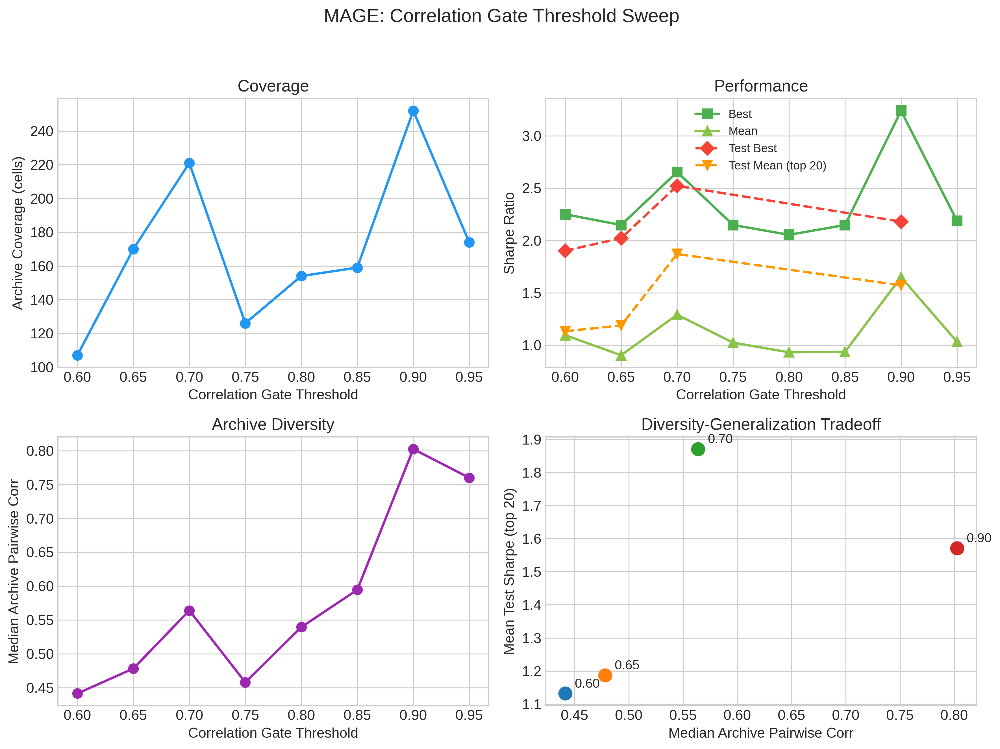
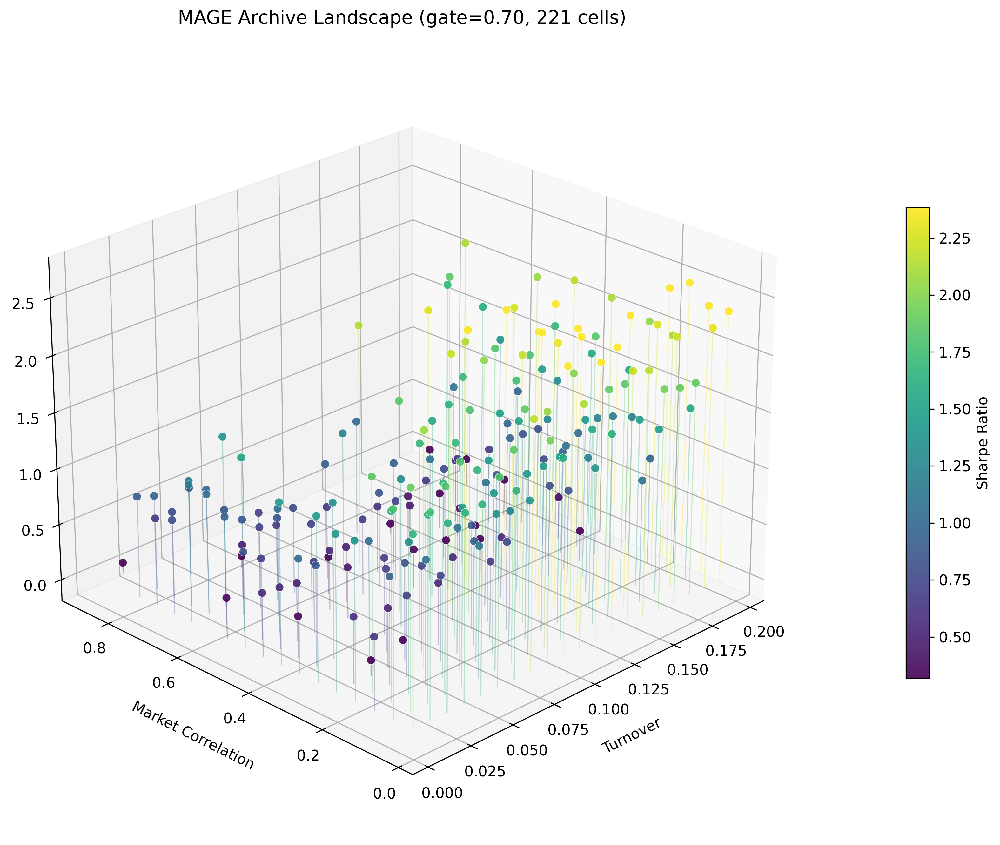
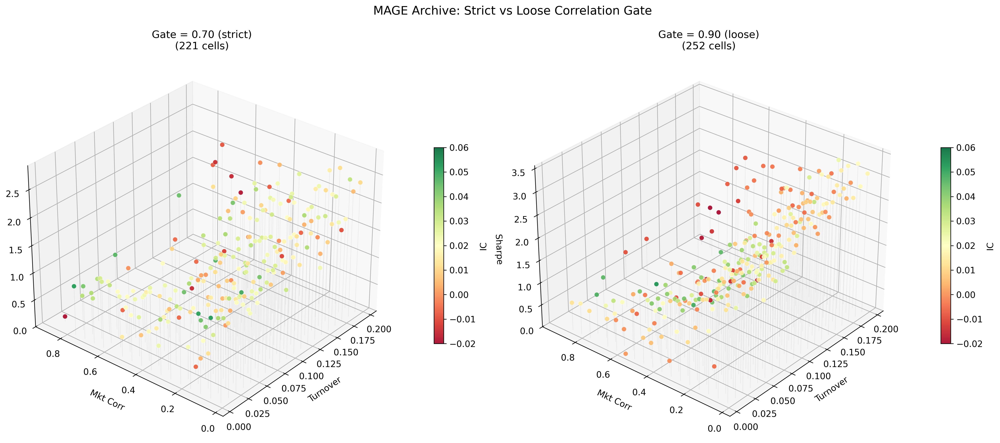
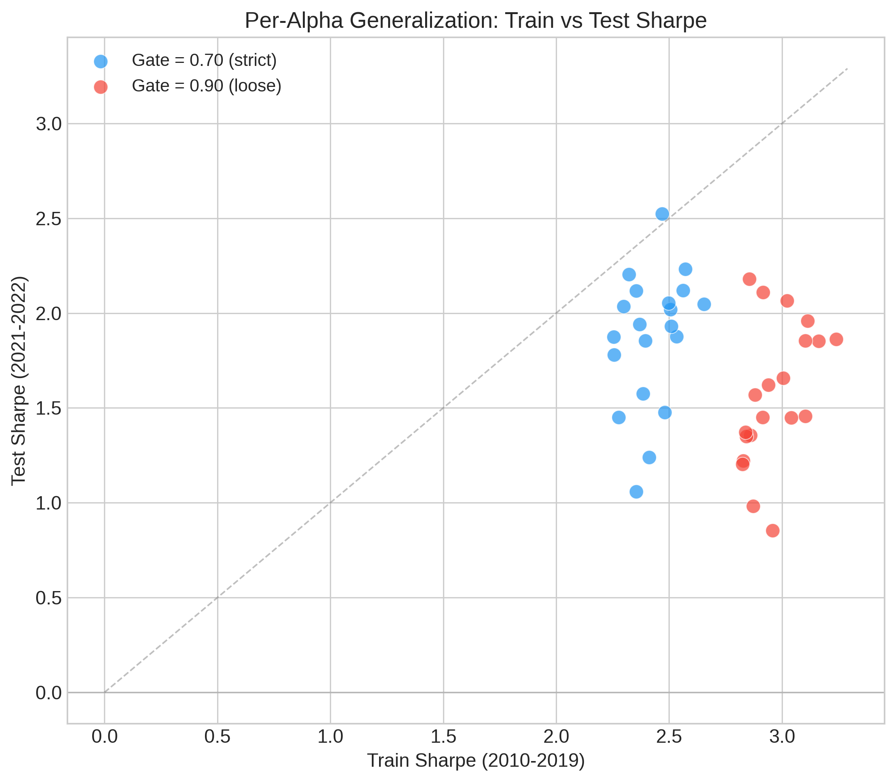
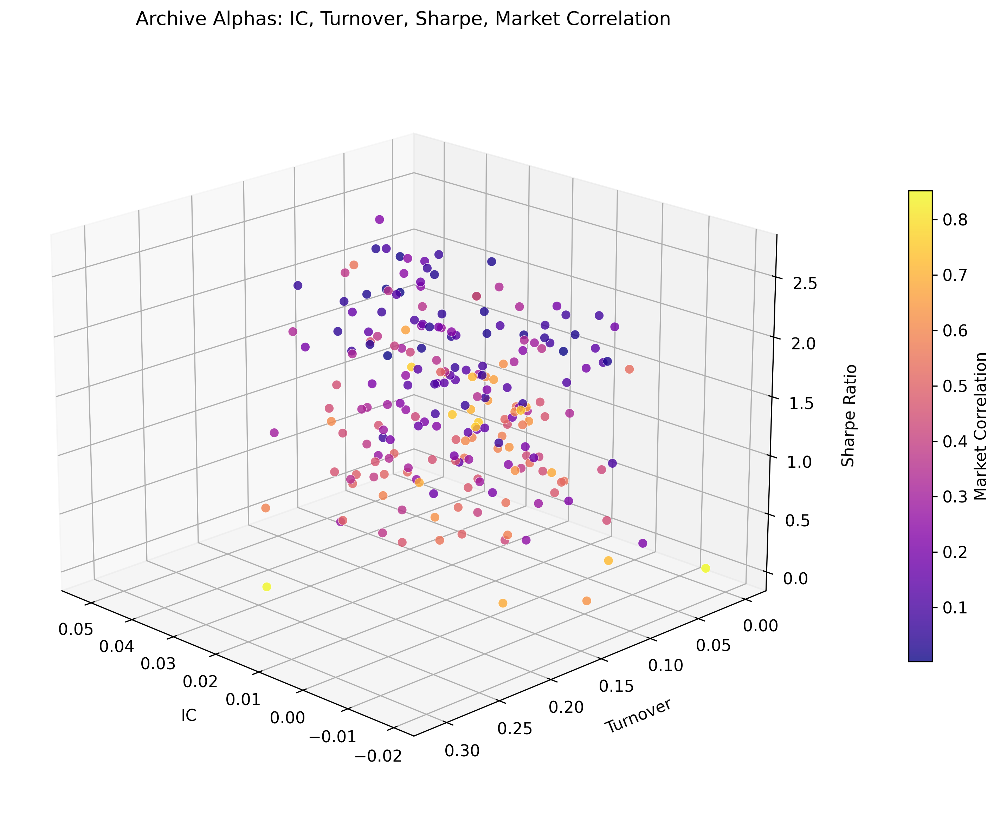
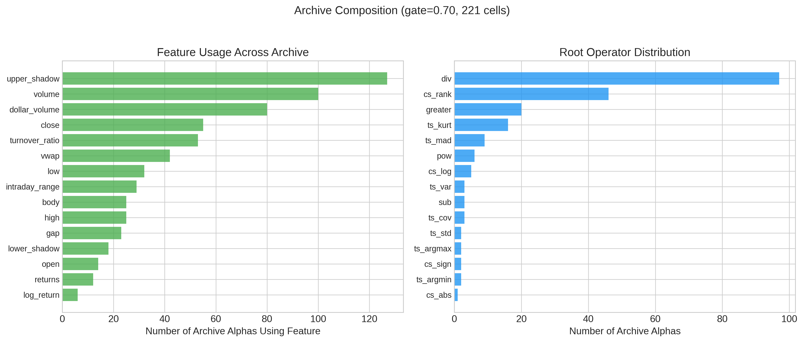
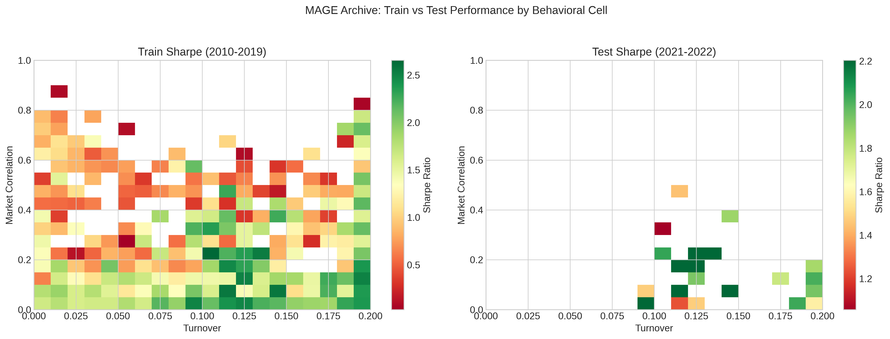
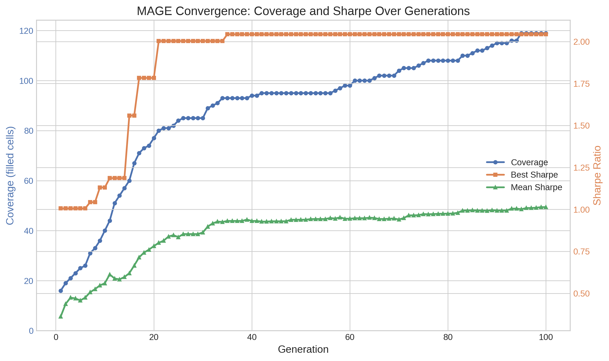
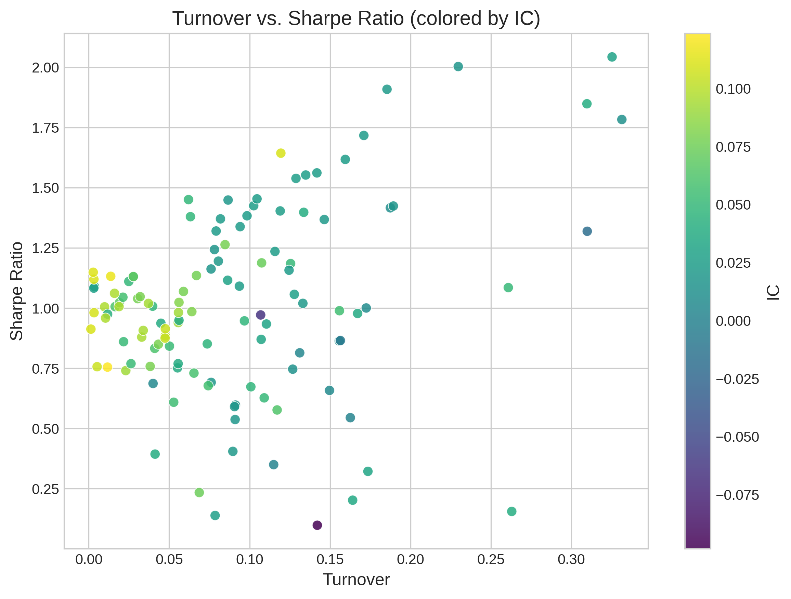

# MAGE: MAP-Elites for Alpha GEneration

MAGE uses MAP-Elites, a quality-diversity evolutionary algorithm, to discover diverse alpha factors for quantitative trading. In finance, relying on a single trading strategy is dangerous. Markets shift, correlations break, and the best-performing factor today may fail tomorrow. A portfolio manager needs a collection of strategies that behave differently from each other, so that when one stops working, the others keep generating returns. MAGE addresses this by evolving alpha factors on a two-dimensional behavioral grid defined by **turnover** (how frequently the strategy rebalances) and **market correlation** (how much the strategy's returns track the overall market). Each cell in the grid keeps only the best alpha for that particular behavioral profile. The result is a structured archive of high-quality, behaviorally distinct alpha factors ready for portfolio construction.

---

## What Are Alpha Factors?

An **alpha factor** is a formula that predicts which stocks will go up and which will go down. You feed it raw market data for each stock (prices and trading volume over time) and it produces a score. Stocks with high scores are expected to outperform; stocks with low scores are expected to underperform. A portfolio manager ranks all stocks by their alpha score, buys the top-ranked ones ("long"), and sells the bottom-ranked ones ("short"). If the alpha is any good, the long stocks rise more than the short stocks fall, and the portfolio makes money regardless of whether the overall market goes up or down.

The raw inputs are **OHLCV data**: Open, High, Low, Close, and Volume. These are recorded for every stock on every trading day. Open is the price at market open. High and Low are the maximum and minimum prices during the day. Close is the price at market close. Volume is how many shares were traded. A derived feature called **VWAP** (volume-weighted average price) is computed from these: roughly `(high + low + close) / 3`. An alpha formula like `sub(ts_ema(low, 60), close)` says "compute the 60-day exponential moving average of each stock's daily low price, then subtract today's closing price." Stocks where the smoothed low is far above the current close might be mean-reverting, so the alpha buys them.

To measure whether an alpha works, we use several metrics. **IC** (Information Coefficient) is the daily cross-sectional correlation between the alpha's scores and the stocks' actual returns over the next 20 trading days. An IC of 0.05 means weak but meaningful predictive power; 0.10 is strong. **Sharpe ratio** measures the risk-adjusted return of a long-short portfolio: annualized mean return divided by annualized volatility. A Sharpe above 1.0 is considered good. **Turnover** measures how much the portfolio's holdings change each day; high turnover means more trading and more transaction costs. **Market correlation** measures how much the alpha's returns move with the broad market; low market correlation means the alpha captures something beyond just "stocks go up when the market goes up." In the backtest, we go long the top 20% of stocks by alpha score and short the bottom 20%, rebalancing daily based on new scores.

---

## What Is MAP-Elites?

MAP-Elites (Mouret and Clune, 2015) is a quality-diversity algorithm. Standard genetic programming (GP) maintains a single population and selects parents by fitness. Over many generations, the population converges to a narrow region of the search space: the single best solution it can find. This is fine if you only need one answer. It is not fine if you need many different answers.

MAP-Elites replaces the population with a grid-structured archive. Each cell in the grid corresponds to a specific combination of behavioral descriptors. When a new solution is evaluated, the algorithm computes both its fitness and its behavioral coordinates, then places it in the appropriate cell. If the cell was empty, the solution fills it. If the cell already had a solution, the new one replaces it only if its fitness is higher. This way, each cell always holds the best solution discovered so far for that particular behavior.

In MAGE, the grid has two axes:

- **Market correlation** (x-axis): ranges from 0 to 1, discretized into 20 bins. Low-correlation alphas are market-neutral; high-correlation alphas track the market.
- **Turnover** (y-axis): ranges from 0 to 0.2, discretized into 20 bins. Low-turnover alphas rebalance slowly; high-turnover alphas trade frequently.

This creates a 20x20 grid with 400 possible cells. The search fills as many cells as it can, and within each cell it pushes the Sharpe ratio as high as possible.

Why does this matter for finance? GP gives you 10 alphas with no control over their turnover or market correlation profiles. MAGE gives you 221 alphas indexed by deployment-relevant behavioral axes. A portfolio manager can select alphas matching specific turnover budgets and market exposure targets. The grid is the product.

---

## The Operator Set (33 Operators)

Alpha expressions are trees built from 33 operators operating on 15 input features. The 6 raw features are `open`, `high`, `low`, `close`, `volume`, `vwap`. 9 derived features are computed from these during data preparation:

| Feature | Formula | What it captures |
|---------|---------|-----------------|
| `returns` | (close - prev_close) / prev_close | Daily return |
| `log_return` | log(close / prev_close) | Log return (better statistical properties) |
| `dollar_volume` | close * volume | Liquidity |
| `turnover_ratio` | volume / adv20 | Activity surprise (volume relative to 20-day average) |
| `intraday_range` | (high - low) / close | Intraday volatility proxy |
| `gap` | open / prev_close - 1 | Overnight return |
| `upper_shadow` | (high - max(open, close)) / close | Selling pressure |
| `lower_shadow` | (min(open, close) - low) / close | Buying pressure |
| `body` | (close - open) / close | Directional conviction |

These derived features break GP out of the "everything is a price ratio" trap. Without them, the search converges to one dominant pattern (e.g., `div(vwap, close)`). With them, the GP can compose signals from returns, volatility, liquidity, and candlestick structure, producing a wider variety of alpha families.

The operators fall into four groups based on two distinctions:

**Cross-sectional vs. time-series.** A cross-sectional operator works across all stocks at a single point in time. For example, `cs_rank(close)` ranks all 50 stocks by their closing price on day _t_, giving each stock a percentile from 0 to 1. Stock with the highest close gets rank 1.0; the lowest gets rank ~0.02. A time-series operator works across time for a single stock. For example, `ts_rank(close, 20)` looks at one stock's closing prices over the past 20 days and reports where today's close falls as a percentile within that window. These are fundamentally different computations even though both are called "rank."

**Unary vs. binary.** Unary operators take one input series (plus an optional window parameter). Binary operators take two input series (plus an optional window parameter).

### Cross-Sectional Unary (5 operators)

| Operator | Description | Example |
|----------|-------------|---------|
| `cs_abs(x)` | Absolute value | `cs_abs(returns)` = magnitude of daily returns |
| `cs_log(x)` | Natural log (0 for non-positive inputs) | `cs_log(volume)` = log trading volume |
| `cs_sign(x)` | Sign: -1, 0, or +1 | `cs_sign(returns)` = direction of daily move |
| `cs_rank(x)` | Cross-sectional percentile rank (0 to 1) | `cs_rank(close)` = relative price rank among all stocks today |
| `cs_scale(x)` | Normalize so sum(abs) = 1 across stocks | `cs_scale(returns)` = relative magnitude, sign preserved |

### Cross-Sectional Binary (7 operators)

| Operator | Description | Example |
|----------|-------------|---------|
| `add(x, y)` | Elementwise addition | `add(close, volume)` |
| `sub(x, y)` | Elementwise subtraction | `sub(high, low)` = daily price range |
| `mul(x, y)` | Elementwise multiplication | `mul(close, volume)` = dollar volume proxy |
| `div(x, y)` | Safe division (returns 0 when denominator < 1e-10) | `div(close, open)` = intraday return ratio |
| `pow(x, y)` | Signed power: `sign(x) * abs(x)^clip(y, -3, 3)` | `pow(volume, returns)` |
| `greater(x, y)` | Elementwise maximum | `greater(open, close)` = max of open and close |
| `less(x, y)` | Elementwise minimum | `less(high, low)` = always equals low |

### Time-Series Unary (19 operators)

All take a window parameter `d` specifying the lookback period in trading days.

| Operator | Window Range | Description | Example |
|----------|-------------|-------------|---------|
| `ts_ref(x, d)` | 1-20 | Value `d` days ago | `ts_ref(close, 5)` = closing price 5 days ago |
| `ts_delta(x, d)` | 1-20 | Change from `d` days ago: `x - ts_ref(x, d)` | `ts_delta(volume, 10)` = 10-day volume change |
| `ts_mean(x, d)` | 3-60 | Rolling mean over `d` days | `ts_mean(close, 20)` = 20-day simple moving average |
| `ts_med(x, d)` | 3-60 | Rolling median over `d` days | `ts_med(volume, 10)` = 10-day median volume |
| `ts_sum(x, d)` | 3-60 | Rolling sum over `d` days | `ts_sum(volume, 5)` = 5-day cumulative volume |
| `ts_std(x, d)` | 3-60 | Rolling standard deviation | `ts_std(close, 20)` = 20-day price volatility |
| `ts_var(x, d)` | 3-60 | Rolling variance | `ts_var(returns, 10)` = 10-day return variance |
| `ts_skew(x, d)` | 5-60 | Rolling skewness | `ts_skew(returns, 20)` = return distribution asymmetry |
| `ts_kurt(x, d)` | 5-60 | Rolling kurtosis (excess) | `ts_kurt(returns, 20)` = return distribution tail weight |
| `ts_max(x, d)` | 3-60 | Rolling maximum | `ts_max(high, 20)` = 20-day high |
| `ts_min(x, d)` | 3-60 | Rolling minimum | `ts_min(low, 20)` = 20-day low |
| `ts_mad(x, d)` | 3-60 | Rolling mean absolute deviation | `ts_mad(returns, 10)` |
| `ts_rank(x, d)` | 3-60 | Percentile rank within rolling window | `ts_rank(close, 20)` = where today's close falls in 20-day history |
| `ts_wma(x, d)` | 3-60 | Weighted moving average (linear decay) | `ts_wma(close, 10)` = recent days weighted more |
| `ts_ema(x, d)` | 3-60 | Exponential moving average | `ts_ema(close, 20)` = EMA with span 20 |
| `ts_argmax(x, d)` | 3-60 | Days since max in window (0=oldest, d-1=newest) | `ts_argmax(close, 20)` = when was the 20-day high? |
| `ts_argmin(x, d)` | 3-60 | Days since min in window | `ts_argmin(close, 20)` = when was the 20-day low? |
| `ts_product(x, d)` | 2-10 | Rolling product (captures compounding) | `ts_product(returns, 5)` = 5-day compounded return |
| `ts_decay_linear(x, d)` | 3-60 | Linearly decaying weighted average | `ts_decay_linear(volume, 10)` = recent volume weighted more |

### Time-Series Binary (2 operators)

| Operator | Window Range | Description | Example |
|----------|-------------|-------------|---------|
| `ts_corr(x, y, d)` | 5-60 | Rolling Pearson correlation | `ts_corr(close, volume, 20)` = 20-day price-volume correlation |
| `ts_cov(x, y, d)` | 5-60 | Rolling covariance | `ts_cov(open, close, 10)` = 10-day open-close covariance |

The core operator set matches AlphaGen (Yu et al., KDD 2023) and draws from Alpha101 (Kakushadze, 2016). The `ts_argmax`/`ts_argmin` operators produce timing signals (integer-valued, fundamentally different from price ratios) that cannot be constructed from the other operators. `ts_product` captures compounding effects. `cs_scale` enables portfolio-weight normalization within expressions.

### Diversity Mechanisms

MAGE uses three mechanisms to prevent the archive from filling with variants of one dominant signal:

1. **Correlation gate.** Before inserting an alpha into the archive, compute its rank correlation with every existing archive member. Reject if `max |corr| > threshold`. This prevents functionally identical alphas from occupying different cells. Inspired by AlphaForge's (AAAI 2025) factor zoo filtering. The optimal threshold is 0.70 (see gate sweep below).

2. **Structural similarity filter.** Hash each GP tree bottom-up (sorting children of commutative operators). Reject if structural similarity with the current cell occupant exceeds 0.8. This catches syntactic variants like `div(vwap, close)` and `div(vwap, mul(close, 1.0))`. Based on Burlacu et al. (CEC 2019).

3. **Novelty-weighted population fitness.** For parent selection, multiply Sharpe by `(1 - max_corr_with_archive)`. Alphas that are novel relative to the archive get higher selection probability. Alphas that duplicate existing archive signals get deprioritized even if their Sharpe is high. Similar to AlphaSAGE's (2025) novelty reward component.

---

## Results

S&P 500 universe (467 stocks with sufficient history), training period 2010-2019 (2,516 days), validation 2020 (253 days), test 2021-2022 (503 days). Population 200, 100 generations, 20x20 grid, 236 CPUs across 18 nodes. This split matches RiskMiner (2024) and is standard in the formulaic alpha literature. The 2021-2022 test period is one of the hardest recent windows (sharpest rate cycle in 40 years, tech selloff, inflation peak).

### Out-of-Sample Performance

All 20 top alphas maintain positive Sharpe and positive IC on the held-out 2021-2022 test set.

| Metric | Train (2010-2019) | Val (2020) | Test (2021-2022) |
|--------|-------------------|------------|------------------|
| Best individual Sharpe | 2.65 | 1.83 | **2.52** |
| Combined top-5 Sharpe | 2.77 | 1.24 | **2.07** |
| Combined top-10 Sharpe | 2.70 | 1.20 | **1.98** |
| Combined top-20 Sharpe | 2.85 | 1.26 | **2.13** |
| Mean IC (top 20) | 0.036 | 0.042 | **0.024** |
| Mean ICIR (top 20) | 0.45 | 0.43 | **0.30** |
| Pairwise corr (top 20) | 0.102 | 0.130 | 0.159 |
| Top 20 positive on test | - | - | **20/20** |

### Multi-Seed Robustness

Four seeds, all with gate=0.70. The method produces consistent results across random initializations.

| Seed | Coverage | Best Train | Mean Train | Top-20 Mean Train | Best Test | Mean Test (top 20) | Positive |
|------|----------|-----------|-----------|-------------------|-----------|-------------------|----------|
| 42 | 221 | 2.655 | 1.290 | 2.423 | **2.523** | **1.871** | **20/20** |
| 1 | 185 | 2.072 | 0.880 | 1.577 | 1.786 | 0.748 | 16/20 |
| 2 | 160 | 2.171 | 0.938 | 1.588 | 1.572 | 0.879 | 17/20 |
| 3 | 156 | 2.116 | 0.993 | 1.670 | 1.788 | 1.001 | 16/20 |
| **Mean** | **180 +/- 26** | **2.254 +/- 0.234** | -- | **1.815 +/- 0.361** | **1.917 +/- 0.360** | **1.125 +/- 0.440** | **17.3/20** |

Seed 42 is the best. All seeds produce 150+ cells and positive test performance. Even the worst seed (seed 2) produces 160 distinct alphas with 17/20 positive on test. The variance reflects the stochastic nature of GP search and the sensitivity of the upper_shadow signal family to initialization.

### Comparison to Published Results

| Method | Market | Test Period | Test Sharpe | Notes |
|--------|--------|-------------|-------------|-------|
| AlphaSAGE (2025) | S&P 500 | 2018-2020 | 6.32 | GFlowNet, includes COVID rally |
| AlphaGen (KDD 2023) | S&P 500 | 2020-2021 | 3.96 | RL (PPO) |
| FactorEngine (2026) | CSI300 | 2017-2024 | 1.01 | |
| Qlib DoubleEnsemble | CSI300 | 2017-2020 | 0.46 | |
| **MAGE combined top-20** | **S&P 500** | **2021-2022** | **2.13** | Hardest recent test period |
| **MAGE best individual** | **S&P 500** | **2021-2022** | **2.52** | |

AlphaSAGE and AlphaGen test on easier periods. Direct comparison requires running on the same data with the same splits. Our test period (2021-2022) includes the Fed hiking from 0% to 4.5% and inflation peaking at 9.1%, making it significantly harder than the 2018-2020 window most papers use.

### Correlation Gate Sweep

The correlation gate controls the tradeoff between archive diversity and peak performance. We swept 8 thresholds from 0.60 to 0.95.

| Gate | Coverage | Train Best | Train Mean | Test Mean (top 20) | Test Best | Positive |
|------|----------|-----------|-----------|-------------------|-----------|----------|
| 0.60 | 107 | 2.25 | 1.10 | 1.13 | 1.90 | 19/20 |
| 0.65 | 170 | 2.15 | 0.90 | 1.19 | 2.02 | 20/20 |
| **0.70** | **221** | **2.65** | **1.29** | **1.87** | **2.52** | **20/20** |
| 0.75 | 126 | 2.15 | 1.02 | 1.18 | 1.78 | 20/20 |
| 0.80 | 154 | 2.05 | 0.93 | 0.76 | 1.65 | 18/20 |
| 0.85 | 159 | 2.15 | 0.94 | 1.18 | 1.77 | 20/20 |
| 0.90 | 252 | **3.24** | **1.65** | 1.57 | 2.18 | 20/20 |
| 0.95 | 174 | 2.19 | 1.03 | 1.24 | 1.80 | 20/20 |

Gate 0.90 maximizes train performance (3.24 best, 1.65 mean, 252 cells). Gate 0.70 maximizes test performance (2.52 best, 1.87 mean top-20). The correlation gate acts as a regularizer: stricter gates force diversity that prevents overfitting to one factor family, improving out-of-sample generalization at the cost of in-sample performance. This parallels the bias-variance tradeoff in supervised learning.

Note: the 0.75, 0.80, 0.85, 0.95 runs did not fully converge (30-85 generations instead of 100) due to cluster tunnel drops. The 0.70 and 0.90 runs are complete at 100 generations.



### No-Gates Ablation

| Condition | Coverage | Best Train | Mean Train | Archive Max Corr (mean) |
|-----------|----------|-----------|-----------|------------------------|
| MAGE (gate=0.70) | 221/400 | 2.655 | 1.290 | 0.683 |
| MAGE (no gates) | 135/400 | 1.962 | 0.999 | 0.712 |

Without the correlation gate, the archive fills with correlated variants. Coverage drops from 221 to 135 despite no gate restricting insertion. The gate forces the search to explore new behavioral regions instead of refining one signal family.

### GP Baseline (10 runs, 6 seeds)

| Seed | Best Sharpe | Pairwise Corr |
|------|-------------|---------------|
| 1 | 3.48 | 0.024 |
| 2 | 3.45 | 0.012 |
| 3 | 3.31 | 0.040 |
| 4 | 3.26 | 0.162 |
| 5 | 3.54 | 0.030 |
| 42 | 3.14 | 0.094 |

**Train:** GP Sharpe 2.895 +/- 0.159 (range 2.629-3.140) across 10 runs (seed 42). GP consistently achieves higher individual Sharpe than MAGE (2.65) because each run spends all compute maximizing a single solution. GP also maintains low pairwise correlation (0.01-0.16) across all seeds with the expanded feature set. With the original 6-feature set (open, high, low, close, volume, vwap only), GP collapsed to one factor family (pairwise corr 0.494, 8/10 runs converging to `div(vwap, close)`).

**Test:** GP baseline test evaluation in progress (re-running with tree object saving for held-out evaluation).

MAGE's contribution over GP is the behavioral grid. GP gives you 10 alphas with no control over their turnover or market correlation profiles. MAGE gives you 221 alphas indexed by deployment-relevant behavioral axes. A portfolio manager can select alphas matching specific turnover budgets and market exposure targets. Additionally, the correlation gate acts as a regularizer that improves test-set generalization.

### Feature Engineering Impact

| Feature Set | GP Pairwise Corr | MAGE Archive Diversity |
|-------------|-----------------|----------------------|
| 6 features (raw OHLCV) | 0.494 (collapse) | Dominated by div(vwap, close) |
| 15 features (raw + derived) | 0.094 (no collapse) | 19 root operators, 221 cells |

The expanded feature set is the primary driver of diversity. The correlation gate acts as regularization (improves test generalization), not as a collapse prevention mechanism.

### Top 20 Alphas (sorted by test Sharpe)

| Rank | Train | Test | IC | Turnover | Expression (truncated) |
|------|-------|------|------|----------|----------------------|
| 1 | 2.47 | 2.52 | 0.032 | 0.110 | `div(div(pow(upper_shadow, cs_rank(ts_min(dollar_volume, 29))), ...)` |
| 2 | 2.57 | 2.23 | 0.023 | 0.142 | `div(div(pow(upper_shadow, cs_rank(ts_min(dollar_volume, 29))), ...)` |
| 3 | 2.32 | 2.20 | 0.022 | 0.117 | `div(div(pow(upper_shadow, cs_rank(ts_min(dollar_volume, 29))), ...)` |
| 4 | 2.56 | 2.12 | 0.026 | 0.107 | `div(div(pow(upper_shadow, cs_rank(ts_min(dollar_volume, 29))), ...)` |
| 5 | 2.35 | 2.12 | 0.032 | 0.118 | `div(div(pow(upper_shadow, cs_rank(ts_min(dollar_volume, 29))), ...)` |
| 6 | 2.50 | 2.05 | 0.037 | 0.086 | `div(div(pow(upper_shadow, cs_rank(ts_min(dollar_volume, 29))), ...)` |
| 7 | 2.65 | 2.05 | 0.036 | 0.100 | `div(pow(upper_shadow, cs_rank(ts_min(dollar_volume, 32))), close)` |
| 8 | 2.30 | 2.04 | 0.028 | 0.180 | `div(upper_shadow, mul(cs_rank(ts_min(dollar_volume, 40)), ...))` |
| 9 | 2.51 | 2.02 | 0.013 | 0.189 | `div(mul(upper_shadow, div(greater(turnover_ratio, ...))), ...)` |
| 10 | 2.37 | 1.94 | 0.027 | 0.199 | `cs_rank(div(mul(upper_shadow, pow(turnover_ratio, ...)), ...))` |
| 11 | 2.51 | 1.93 | 0.031 | 0.128 | `div(pow(upper_shadow, cs_rank(ts_min(volume, 35))), open)` |
| 12 | 2.53 | 1.88 | 0.030 | 0.126 | `div(div(pow(upper_shadow, cs_rank(ts_min(dollar_volume, 29))), ...)` |
| 13 | 2.26 | 1.88 | 0.020 | 0.127 | `div(pow(upper_shadow, cs_rank(ts_min(lower_shadow, 29))), close)` |
| 14 | 2.40 | 1.86 | 0.021 | 0.214 | `div(mul(upper_shadow, div(greater(dollar_volume, ...))), ...)` |
| 15 | 2.26 | 1.78 | 0.020 | 0.179 | `div(div(upper_shadow, cs_rank(close)), dollar_volume)` |
| 16 | 2.38 | 1.57 | 0.010 | 0.247 | `div(mul(upper_shadow, div(greater(turnover_ratio, ...))), ...)` |
| 17 | 2.48 | 1.48 | 0.010 | 0.107 | `div(div(pow(upper_shadow, cs_rank(ts_min(dollar_volume, 29))), ...)` |
| 18 | 2.28 | 1.45 | 0.018 | 0.103 | `div(div(pow(upper_shadow, cs_rank(ts_min(dollar_volume, 34))), ...)` |
| 19 | 2.41 | 1.24 | 0.022 | 0.096 | `div(pow(upper_shadow, cs_rank(ts_min(dollar_volume, 37))), ...)` |
| 20 | 2.35 | 1.06 | 0.021 | 0.108 | `div(less(pow(upper_shadow, cs_rank(ts_min(dollar_volume, 28))), ...)` |

All 20 positive on test. All 20 positive IC. Test Sharpe distribution: min=1.058, median=1.936, max=2.523, mean=1.871.

The dominant signal family combines selling pressure (`upper_shadow`), liquidity ranking (`cs_rank(ts_min(dollar_volume, d))`), and price normalization (`div(..., close/open)`). Stocks with high selling pressure relative to their liquidity rank tend to revert. The diversity mechanisms ensure the archive also contains structurally different alphas using `turnover_ratio`, `body`, `ts_corr`, and other features in lower cells.

### Figures



The archive landscape shows 221 alphas spread across the turnover x market correlation grid. Height is Sharpe ratio. The stems make the performance gradient visible: high-turnover, low-correlation cells tend to have the strongest alphas.



Side-by-side 3D comparison. Gate=0.70 (strict, left) spreads alphas more evenly across the behavioral space. Gate=0.90 (loose, right) has more cells but they cluster in a denser region with more correlated signals. Color is IC.



Gate=0.70 (blue) achieves better test-to-train ratios than gate=0.90 (red). Strict diversity gates improve out-of-sample performance.



Four dimensions in one view: IC (x), turnover (y), Sharpe (z), market correlation (color). Shows the archive spans the full behavioral space with positive IC across most cells.









---

## Literature Review: Quality-Diversity in Finance

### Foundational QD

**Mouret and Clune (2015), "Illuminating search spaces by mapping elites."** The original MAP-Elites paper. Proposes filling a grid archive where each cell stores the highest-fitness solution for a given behavioral profile. Simple to implement, effective in practice. This is the algorithm MAGE builds on.

**Lehman and Stanley (2011), "Abandoning Objectives: Evolution through the Search for Novelty Alone," Evolutionary Computation 19(2).** The stepping-stones argument. On a deceptive maze problem, novelty search (which ignores fitness entirely and rewards behavioral novelty) solved the problem 39/40 times. Fitness-based search solved it 3/40 times. The reason: fitness-following gets trapped in local optima, while diversity maintenance discovers intermediate behaviors that serve as stepping stones to the global optimum. This is the theoretical motivation for why MAP-Elites can find better individual solutions than single-objective GP.

**Ren, Zheng, and Qian (2024), "Quality-Diversity Algorithms Can Provably Be Helpful for Optimization," IJCAI 2024.** The first formal proof that QD helps optimization. On two NP-hard problem classes (monotone approximately submodular maximization and set cover), MAP-Elites achieves the asymptotically optimal polynomial-time approximation ratio, while a standard (mu+1)-EA requires exponential expected time on some instances. When a reviewer asks "why not just run more single-objective GP?", this paper gives the formal answer.

### Alpha Generation Methods

**Yu et al. (2023), "Generating Synergistic Formulaic Alpha Collections via Reinforcement Learning," KDD 2023 (AlphaGen).** Uses PPO (a reinforcement learning algorithm) to generate alpha factors as token sequences. The RL reward includes both individual alpha quality and a "synergy" term encouraging diversity in the generated set. The operator set and evaluation pipeline in MAGE match AlphaGen for comparability. AlphaGen achieves Sharpe 3.96 on S&P 500, 0.76 on CSI300.

**Shi et al. (2025), "AlphaForge: Mining and Dynamically Combining Formulaic Alpha Factors," AAAI 2025.** A generative model that proposes alpha candidates, paired with a dynamic combination model that selects and weights them. Achieves Sharpe 6.30 on S&P 500. Diversity comes from a filtering step that removes highly correlated candidates, but there is no explicit diversity optimization in the search process itself.

**AlphaSAGE (2025).** Uses GFlowNets to generate diverse alpha factor collections. GFlowNets sample solutions proportional to a reward function, producing diversity as a natural consequence of the sampling distribution. Reports Sharpe 6.32 on S&P 500 (2018-2020 test), IC 0.052. The closest prior work to our diversity-first approach, but uses RL rather than evolutionary computation and does not use an archive structure.

### QD for Portfolio Construction

**Gomes, Lim, and Cully (2024), "Finding Near-Optimal Portfolios with Quality-Diversity," EvoApplications 2024.** The only prior paper applying MAP-Elites directly to a finance problem. Uses CVT-MAP-Elites to discover diverse near-optimal portfolio allocations, filling ~75% of niches with near-optimal solutions. Demonstrates that QD gives a portfolio manager a structured menu of alternatives rather than a single point estimate. Closely related to our work, but operates at the portfolio-allocation level rather than at the alpha-discovery level.

### The Gap

Quality-diversity methods have been applied to robotics (Cully et al., Nature 2015), game design, creative text generation (QDAIF, ICLR 2024), and more. In finance, the literature is almost empty. AlphaGen and AlphaForge treat diversity as a secondary concern or a filtering step. Gomes et al. work at the portfolio allocation level, not the factor level. No prior work uses MAP-Elites or any archive-based QD algorithm for alpha factor generation. MAGE fills this gap: diversity by construction, organized by behaviorally meaningful axes, producing a directly deployable archive.

---

## Project Structure

```
MAGE/
    run_gp_baseline_and_eval.sh  # GP baseline + test eval (Linux/macOS)
    run_gp_baseline_and_eval.py  # GP baseline + test eval (Windows/any OS)
    alpha_factory/              # Core library
        __init__.py
        operators.py            # 33 operators (CS unary/binary, TS unary/binary)
        gp_genome.py            # GP expression trees, matrix-level eval with proper CS ops
        evaluate.py             # Alpha evaluation: IC, Sharpe, turnover, market_corr, backtest
        data.py                 # OHLCV download (Yahoo Finance), caching, train/val/test splits
    experiments/
        run_gp_mapelites.py     # MAP-Elites, GP baseline, random baseline (local)
        run_cluster.py          # Distributed experiments on Ray cluster
        eval_test_set.py        # Evaluate saved archive on held-out test set
        run_qlib.py             # Qlib dataset integration (CSI300/CSI500)
        run_csi.sh              # One-command CSI experiment runner (setup, data, run)
        setup_qlib.py           # Qlib environment setup
    results/
        mage_sp500_v2/          # Main result (gate=0.70, seed=42, 221 cells, grid.pkl included)
        mage_seed{1,2,3}/       # Multi-seed robustness runs
        mage_gate_{060..095}/   # Correlation gate sweep
        gp_baseline_sp500_v2/   # GP baseline (seed=42, 10 runs)
        gp_multiseed_s{1..5}/   # GP multi-seed
        test_*/                 # Test set evaluation outputs
    scripts/
        generate_figures.py     # Standard figures from checkpoint
        generate_paper_figures.py  # Compound figures (gate sweep, train-vs-test, composition)
        generate_3d_figures.py  # 3D archive landscape plots
    figures/                    # Generated figures (PNG, 300 DPI)
    data/                       # Cached OHLCV (auto-downloaded on first run)
```

---

## How to Run

### Setup

```bash
git clone https://github.com/joconno2/MAGE.git
cd MAGE
python3 -m venv .venv
.venv/bin/pip install -r requirements.txt
```

Dependencies: `numpy`, `scipy`, `pandas`, `yfinance`, `matplotlib`. Python 3.10+.

### GP Baseline + Test Evaluation (S&P 500)

Runs the GP baseline (10 independent runs, pop=200, 100 gens) and evaluates both the GP results and the included MAP-Elites archive on the held-out 2021-2022 test set. One script, no arguments needed.

```bash
# Linux / macOS
./run_gp_baseline_and_eval.sh

# Windows (or any OS)
python run_gp_baseline_and_eval.py
```

This creates the venv if it doesn't exist, downloads S&P 500 data (cached after first run), runs the GP baseline, saves tree objects for test evaluation, then runs `eval_test_set.py` against both the GP trees and the MAP-Elites archive (`results/mage_sp500_v2/grid.pkl`, included in the repo).

Takes 2-4 hours depending on your machine. Output:

- `results/gp_baseline_final/result.json` -- train metrics per run
- `results/gp_baseline_final/trees.pkl` -- pickled GP trees
- `results/test_eval_final/gp_train.json`, `gp_val.json`, `gp_test.json` -- GP eval on each split
- `results/test_eval_final/mapelites_test.json` -- MAP-Elites eval on test set

### CSI300/CSI500 Experiments (Chinese Equities)

For direct comparison to AlphaGen (KDD 2023) and AlphaForge (AAAI 2025). Uses AlphaGen's exact data protocol: train 2009-2018, val 2019, test 2020-2021.

**Step 1: One-time setup.** Installs [Qlib](https://github.com/microsoft/qlib) and downloads CSI market data (~5GB).

```bash
./experiments/run_csi.sh setup
```

**Step 2: Run experiments.** Runs MAP-Elites (pop=200, 100 gens) and GP baseline (10 runs, 100 gens) on the chosen market.

```bash
# CSI300 (primary, matches AlphaGen)
./experiments/run_csi.sh all --market csi300

# CSI500 (secondary)
./experiments/run_csi.sh all --market csi500
```

Or run MAP-Elites and GP separately:

```bash
./experiments/run_csi.sh mapelites --market csi300
./experiments/run_csi.sh gp --market csi300
```

Output goes to `results/csi_csi300_mapelites/` and `results/csi_csi300_gp/`.

Both scripts handle venv creation automatically.

### Run MAP-Elites (S&P 500, manual)

```bash
.venv/bin/python experiments/run_gp_mapelites.py mapelites \
    --output results/my_run \
    --pop 200 \
    --gens 100 \
    --grid-size 20 \
    --n-stocks 500 \
    --corr-threshold 0.70
```

Downloads S&P 500 OHLCV data (cached after first run), runs MAP-Elites with correlation gate at 0.70. Output: `checkpoint.json` (metrics) and `grid.pkl` (archive with tree objects).

### Evaluate on Test Set (manual)

```bash
.venv/bin/python experiments/eval_test_set.py \
    --mapelites-grid results/mage_sp500_v2/grid.pkl \
    --gp-result results/gp_baseline_final/result.json \
    --n-stocks 500 \
    --output results/test_eval
```

Evaluates MAP-Elites archive and GP trees on train/val/test splits. Computes combined portfolio Sharpe (top-5/10/20) and pairwise signal correlations.

### Run on Ray Cluster

```bash
.venv/bin/python experiments/run_cluster.py mapelites \
    --output results/cluster_run \
    --pop 200 \
    --gens 100 \
    --corr-threshold 0.70
```

Same algorithm, parallelized across a Ray cluster. Requires `ray` and `aall_cluster`.

### Generate Figures

```bash
.venv/bin/python scripts/generate_figures.py results/mage_sp500_v2/checkpoint.json
.venv/bin/python scripts/generate_paper_figures.py
.venv/bin/python scripts/generate_3d_figures.py
```

---

### Archive Distribution (seed 42)

| Metric | Value |
|--------|-------|
| Coverage | 221/400 (55%) |
| Unique root operators | 19 |
| Sharpe: p25 / p50 / p75 | 0.762 / 1.277 / 1.792 |
| IC: mean | 0.0186 |
| Turnover: min / mean / max | 0.000 / 0.102 / 0.308 |
| Market corr: min / mean / max | 0.002 / 0.324 / 0.852 |

Root operators found: cs_abs, cs_log, cs_rank, cs_sign, div, greater, less, mul, pow, sub, ts_argmax, ts_argmin, ts_cov, ts_kurt, ts_mad, ts_product, ts_std, ts_sum, ts_var.

---

## Paper Target

**IEEE CIFEr 2026**, Tokyo, Sep 10-11. Deadline: **May 15, 2026**.

- 8 pages max, IEEE double-column (IEEEtran.cls), blind review, PDF via CMT
- Up to 2 extra pages at JPY 16,000/page
- Template: https://www.ieee.org/conferences/publishing/templates.html
- Submission: https://cmt3.research.microsoft.com/CIFEr2026/

---

## Citation

```bibtex
@article{oconnor2026mage,
  title     = {{MAGE}: {MAP}-Elites for Alpha Generation},
  author    = {O'Connor, Jim and Mullinax, Mitch and Fernandez, Melanie and Parker, Gary},
  year      = {2026},
}
```
